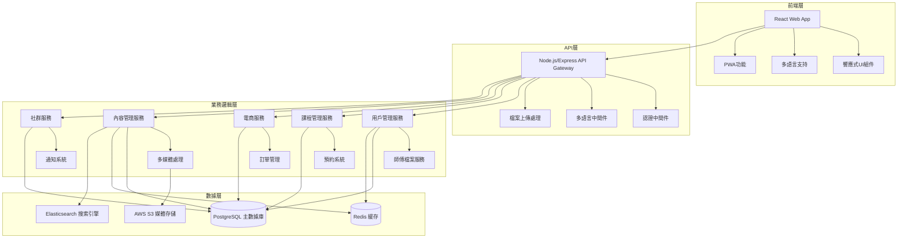

# 設計文檔

## 概述

香港弱勢行業傳承平台採用現代化的全端web應用架構，結合電商功能、社群互動和多媒體內容管理。系統設計重點關注可擴展性、多語言支持、安全性和優秀的用戶體驗。

## 架構

### 整體架構



### 技術棧選擇

**前端技術：**
- React 18 with TypeScript - 現代化組件開發
- Next.js 14 - SSR/SSG支持，SEO優化
- Tailwind CSS - 響應式設計和快速開發
- React Query - 數據狀態管理和緩存
- i18next - 多語言國際化支持

**後端技術：**
- Node.js with Express - 高性能API服務
- TypeScript - 類型安全和開發效率
- Prisma ORM - 數據庫操作和遷移管理
- JWT + Passport.js - 認證和授權
- Socket.io - 實時通信功能

**數據庫和存儲：**
- PostgreSQL - 主要關係型數據庫
- Redis - 會話存儲和緩存
- AWS S3 - 媒體檔案存儲
- Elasticsearch - 全文搜索和內容發現

## 組件和接口

### 核心組件架構

#### 1. 用戶管理組件
```typescript
interface UserService {
  // 用戶註冊和認證
  registerUser(userData: UserRegistrationData): Promise<User>
  authenticateUser(credentials: LoginCredentials): Promise<AuthResult>
  
  // 師傅檔案管理
  createCraftsmanProfile(userId: string, profileData: CraftsmanProfileData): Promise<CraftsmanProfile>
  updateCraftsmanProfile(profileId: string, updates: Partial<CraftsmanProfileData>): Promise<CraftsmanProfile>
  
  // 用戶關注和通知
  followCraftsman(userId: string, craftsmanId: string): Promise<void>
  getFollowingUpdates(userId: string): Promise<Update[]>
}
```

#### 2. 課程和教學組件
```typescript
interface CourseService {
  // 課程管理
  createCourse(craftsmanId: string, courseData: CourseData): Promise<Course>
  searchCourses(criteria: SearchCriteria): Promise<Course[]>
  
  // 預約系統
  bookCourse(userId: string, courseId: string, bookingData: BookingData): Promise<Booking>
  manageWaitlist(courseId: string): Promise<WaitlistEntry[]>
  
  // 教學內容
  uploadLearningMaterial(courseId: string, material: LearningMaterial): Promise<void>
}
```

#### 3. 電商組件
```typescript
interface EcommerceService {
  // 產品管理
  createProduct(craftsmanId: string, productData: ProductData): Promise<Product>
  updateInventory(productId: string, quantity: number): Promise<void>
  
  // 訂單處理
  createOrder(userId: string, orderData: OrderData): Promise<Order>
  processPayment(orderId: string, paymentData: PaymentData): Promise<PaymentResult>
  
  // 物流管理
  updateShippingStatus(orderId: string, status: ShippingStatus): Promise<void>
  trackDelivery(trackingNumber: string): Promise<DeliveryInfo>
}
```

#### 4. 內容管理組件
```typescript
interface ContentService {
  // 多媒體處理
  uploadMedia(file: File, metadata: MediaMetadata): Promise<MediaFile>
  processVideo(videoId: string): Promise<ProcessedVideo>
  
  // 內容分類和搜索
  categorizeContent(contentId: string, categories: string[]): Promise<void>
  searchContent(query: SearchQuery): Promise<SearchResult[]>
  
  // 多語言內容
  translateContent(contentId: string, targetLanguage: string): Promise<TranslatedContent>
}
```

### API接口設計

#### RESTful API端點

**用戶和認證：**
- `POST /api/auth/register` - 用戶註冊
- `POST /api/auth/login` - 用戶登入
- `GET /api/users/profile` - 獲取用戶資料
- `PUT /api/craftsmen/:id/profile` - 更新師傅檔案

**課程和教學：**
- `GET /api/courses` - 搜索課程
- `POST /api/courses` - 創建課程
- `POST /api/courses/:id/bookings` - 預約課程
- `GET /api/courses/:id/materials` - 獲取教學材料

**電商功能：**
- `GET /api/products` - 瀏覽產品
- `POST /api/products` - 上架產品
- `POST /api/orders` - 創建訂單
- `POST /api/payments` - 處理付款

**內容管理：**
- `POST /api/media/upload` - 上傳媒體檔案
- `GET /api/content/search` - 搜索內容
- `GET /api/crafts/:category` - 按分類瀏覽工藝

## 數據模型

### 核心數據實體

```sql
-- 用戶表
CREATE TABLE users (
    id UUID PRIMARY KEY DEFAULT gen_random_uuid(),
    email VARCHAR(255) UNIQUE NOT NULL,
    password_hash VARCHAR(255) NOT NULL,
    role VARCHAR(50) NOT NULL DEFAULT 'learner',
    preferred_language VARCHAR(10) DEFAULT 'zh-HK',
    created_at TIMESTAMP DEFAULT CURRENT_TIMESTAMP,
    updated_at TIMESTAMP DEFAULT CURRENT_TIMESTAMP
);

-- 師傅檔案表
CREATE TABLE craftsman_profiles (
    id UUID PRIMARY KEY DEFAULT gen_random_uuid(),
    user_id UUID REFERENCES users(id) ON DELETE CASCADE,
    craft_specialties TEXT[] NOT NULL,
    bio JSONB, -- 多語言個人介紹
    experience_years INTEGER,
    workshop_location VARCHAR(255),
    contact_info JSONB,
    verification_status VARCHAR(50) DEFAULT 'pending',
    created_at TIMESTAMP DEFAULT CURRENT_TIMESTAMP
);

-- 課程表
CREATE TABLE courses (
    id UUID PRIMARY KEY DEFAULT gen_random_uuid(),
    craftsman_id UUID REFERENCES craftsman_profiles(id),
    title JSONB NOT NULL, -- 多語言標題
    description JSONB, -- 多語言描述
    craft_category VARCHAR(100) NOT NULL,
    max_participants INTEGER,
    duration_hours DECIMAL(4,2),
    price DECIMAL(10,2),
    status VARCHAR(50) DEFAULT 'active',
    created_at TIMESTAMP DEFAULT CURRENT_TIMESTAMP
);

-- 產品表
CREATE TABLE products (
    id UUID PRIMARY KEY DEFAULT gen_random_uuid(),
    craftsman_id UUID REFERENCES craftsman_profiles(id),
    name JSONB NOT NULL, -- 多語言產品名稱
    description JSONB, -- 多語言描述
    price DECIMAL(10,2) NOT NULL,
    inventory_quantity INTEGER DEFAULT 0,
    is_customizable BOOLEAN DEFAULT FALSE,
    craft_category VARCHAR(100) NOT NULL,
    status VARCHAR(50) DEFAULT 'active',
    created_at TIMESTAMP DEFAULT CURRENT_TIMESTAMP
);

-- 訂單表
CREATE TABLE orders (
    id UUID PRIMARY KEY DEFAULT gen_random_uuid(),
    user_id UUID REFERENCES users(id),
    total_amount DECIMAL(10,2) NOT NULL,
    status VARCHAR(50) DEFAULT 'pending',
    shipping_address JSONB,
    payment_status VARCHAR(50) DEFAULT 'pending',
    created_at TIMESTAMP DEFAULT CURRENT_TIMESTAMP
);

-- 媒體檔案表
CREATE TABLE media_files (
    id UUID PRIMARY KEY DEFAULT gen_random_uuid(),
    uploader_id UUID REFERENCES users(id),
    file_type VARCHAR(50) NOT NULL,
    file_url VARCHAR(500) NOT NULL,
    file_size BIGINT,
    metadata JSONB,
    created_at TIMESTAMP DEFAULT CURRENT_TIMESTAMP
);
```

### 關係設計

- 用戶可以是學習者、師傅或管理員
- 師傅可以創建多個課程和產品
- 課程支持預約和候補機制
- 產品支持庫存管理和客製化選項
- 所有內容支持多語言版本

## 錯誤處理

### 錯誤分類和處理策略

#### 1. 客戶端錯誤處理
```typescript
class ErrorHandler {
  // 表單驗證錯誤
  handleValidationError(error: ValidationError): UserFriendlyMessage
  
  // 網路連接錯誤
  handleNetworkError(error: NetworkError): RetryStrategy
  
  // 認證錯誤
  handleAuthError(error: AuthError): RedirectAction
}
```

#### 2. 服務端錯誤處理
```typescript
// 全局錯誤中間件
app.use((error: Error, req: Request, res: Response, next: NextFunction) => {
  // 記錄錯誤
  logger.error(error)
  
  // 根據錯誤類型返回適當響應
  if (error instanceof ValidationError) {
    return res.status(400).json({ message: error.message, field: error.field })
  }
  
  if (error instanceof AuthenticationError) {
    return res.status(401).json({ message: 'Authentication required' })
  }
  
  // 默認服務器錯誤
  return res.status(500).json({ message: 'Internal server error' })
})
```

#### 3. 支付錯誤處理
- 支付失敗自動重試機制
- 訂單狀態回滾處理
- 庫存鎖定和釋放機制
- 退款處理流程

## 測試策略

### 測試金字塔

#### 1. 單元測試 (70%)
```typescript
// 業務邏輯測試
describe('CourseService', () => {
  test('should create course with valid data', async () => {
    const courseData = createValidCourseData()
    const result = await courseService.createCourse(craftsmanId, courseData)
    expect(result).toHaveProperty('id')
    expect(result.status).toBe('active')
  })
})

// 數據模型測試
describe('User Model', () => {
  test('should validate email format', () => {
    const user = new User({ email: 'invalid-email' })
    expect(user.validate()).toHaveErrors(['email'])
  })
})
```

#### 2. 集成測試 (20%)
```typescript
// API端點測試
describe('Course API', () => {
  test('POST /api/courses should create course', async () => {
    const response = await request(app)
      .post('/api/courses')
      .set('Authorization', `Bearer ${authToken}`)
      .send(courseData)
      .expect(201)
    
    expect(response.body).toHaveProperty('id')
  })
})

// 數據庫集成測試
describe('Database Integration', () => {
  test('should handle concurrent booking requests', async () => {
    const promises = Array(10).fill(null).map(() => 
      courseService.bookCourse(userId, courseId, bookingData)
    )
    
    const results = await Promise.allSettled(promises)
    const successful = results.filter(r => r.status === 'fulfilled')
    expect(successful).toHaveLength(course.maxParticipants)
  })
})
```

#### 3. 端到端測試 (10%)
```typescript
// 用戶流程測試
describe('User Journey', () => {
  test('complete course booking flow', async () => {
    // 用戶登入
    await page.goto('/login')
    await page.fill('[data-testid=email]', 'user@example.com')
    await page.fill('[data-testid=password]', 'password')
    await page.click('[data-testid=login-button]')
    
    // 搜索課程
    await page.goto('/courses')
    await page.fill('[data-testid=search]', '手雕麻將')
    await page.click('[data-testid=search-button]')
    
    // 預約課程
    await page.click('[data-testid=course-card]:first-child')
    await page.click('[data-testid=book-course]')
    await page.fill('[data-testid=booking-notes]', '初學者')
    await page.click('[data-testid=confirm-booking]')
    
    // 驗證預約成功
    await expect(page.locator('[data-testid=success-message]')).toBeVisible()
  })
})
```

### 測試環境配置

#### 1. 測試數據庫
- 使用Docker容器化的PostgreSQL測試實例
- 每次測試前重置數據庫狀態
- 使用工廠模式生成測試數據

#### 2. 模擬服務
- 模擬第三方支付API
- 模擬檔案上傳服務
- 模擬郵件發送服務

#### 3. 性能測試
- 使用Artillery進行負載測試
- 監控API響應時間
- 測試數據庫查詢性能